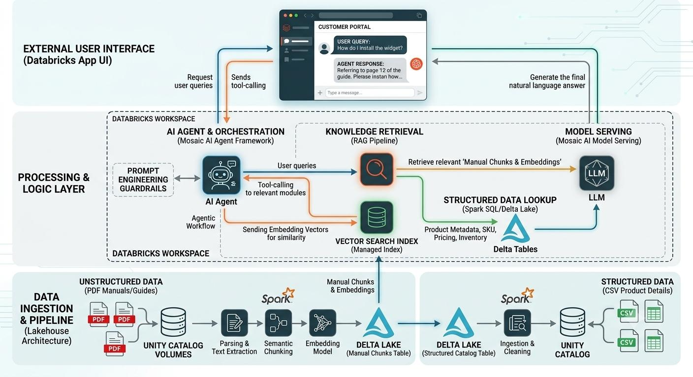

# 🚀 Intelligent Product Support Portal (RAG + Agent Architecture on Databricks)

This project demonstrates an **end-to-end Retrieval-Augmented Generation (RAG) system** built on the **Databricks Lakehouse Platform**, combining structured product data and unstructured documentation to power an intelligent support assistant.

---
## System Design:

---

## 📌 Architecture Overview

### 🥉 1. Data Ingestion & Bronze Layer
- **Structured Data:** Product catalog data (CSV) is ingested into high-performance **Delta Lake tables**.
- **Unstructured Data:** Product manuals (PDFs) are securely stored in **Unity Catalog Volumes**.

---

### 🥈 2. Silver Layer: Parsing, Chunking & Embeddings
- PDFs are processed using text extraction libraries.
- **Semantic Chunking:**  
  Text is split into optimal token-sized chunks with overlapping windows to maintain context.
- **Vectorization:**  
  Embedding models convert each chunk into dense vectors and store them in a Delta table.

---

### 🥇 3. Gold Layer: Vector Search Indexing
- A **Databricks Managed Vector Search Index** is built on top of the embeddings table.
- The index auto-syncs with Delta tables, ensuring **real-time updates** when new documents are added.

---

### 🤖 4. Semantic Routing & Agent Workflow
- Powered by the **Mosaic AI Agent Framework**.
- Implements **Hybrid Search**:
  - 🔎 **Vector Search** → semantic understanding from manuals  
  - 🧮 **Delta SQL Queries** → structured lookups (price, SKU, technical specs)
- **Context Assembly:**
  - Aggregates results from both sources
  - Applies prompt guardrails
  - Sends structured context to the LLM

---

### 🌐 5. Application UI Layer
- Deployed as a **Databricks App**
- Provides:
  - Secure access
  - Low latency
  - Enterprise-ready interface

---

## 🛠️ Tech Stack

| Category | Technologies |
|----------|------------|
| **Core GenAI** | Large Language Models (LLMs), Prompt Engineering |
| **Data Platform** | Databricks Lakehouse, Unity Catalog, Delta Lake |
| **RAG Pipeline** | Embeddings, Semantic Chunking, Hybrid Retrieval |
| **Vector Database** | Databricks Vector Search |
| **Agent Framework** | Mosaic AI Agents (tool use + routing) |
| **Deployment** | Databricks Apps, Model Serving |

---

## 🚀 Key Features

✅ **Hybrid Knowledge Retrieval**  
- Answers both:
  - "How does this work?" (from manuals)
  - "Which Products?" (from structured data)

✅ **Source Attribution (Citations)**  
- Every response includes:
  - PDF + page reference  
  - or CSV record  
→ Improves trust and reduces hallucinations

✅ **Auto-Sync Data Pipeline**  
- Updates automatically when:
  - New products are added  
  - Manuals are updated  

✅ **Enterprise Governance**  
- Full lineage and control using **Unity Catalog**

---
